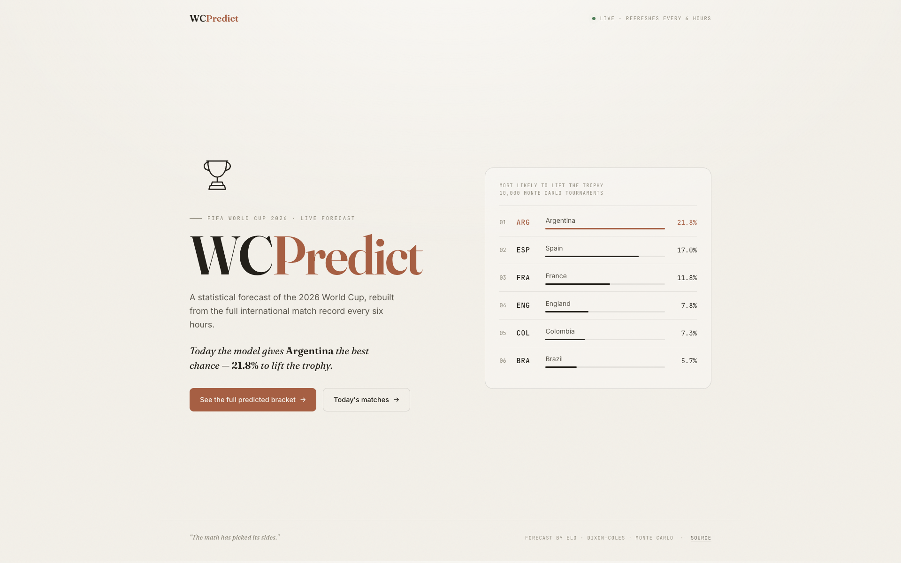
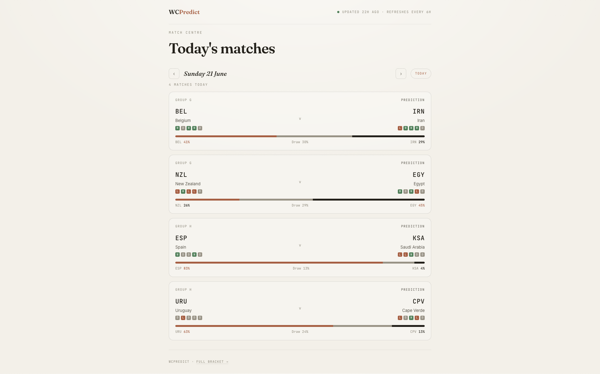
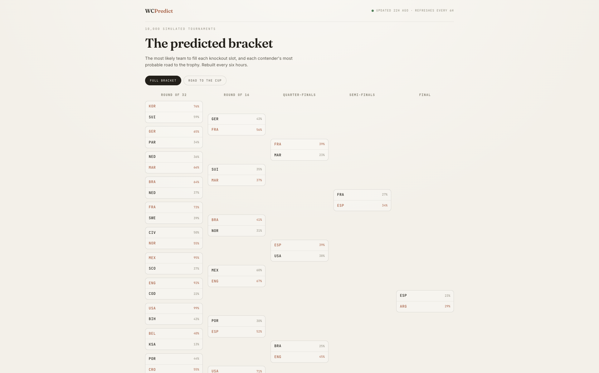
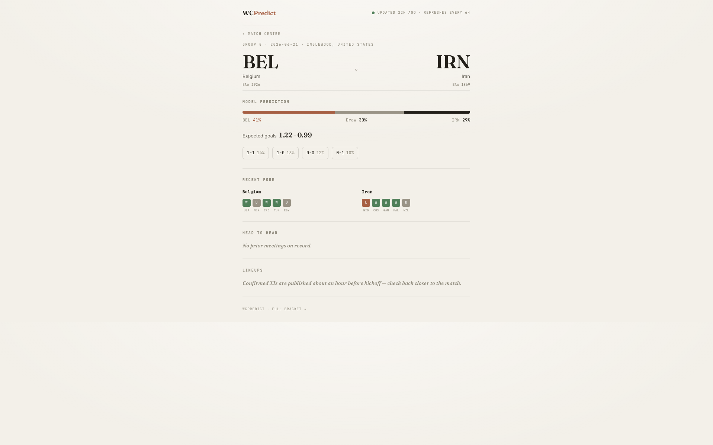

# WCPredict

**Statistical predictions for the 2026 FIFA World Cup — recomputed every hour, no vibes.**

🔗 **Live:** [wcpredict.in](https://wcpredict.in)

WCPredict simulates the entire World Cup 10,000 times an hour and reports what the numbers say: each team's odds of winning the group, surviving each knockout round, and lifting the trophy. Every match page gives a win/draw/loss prediction, expected goals, the most likely scorelines, recent form, and head-to-head history. When confirmed lineups are published (~1h before kickoff), they show up too.

No expert takes. No editorial bias. Just an Elo rating model, a Dixon–Coles scoreline model, and a Monte Carlo en<div align="center">


<a href="https://readme-typing-svg.demolab.com">
  
</a>

<br/>

[](https://wcpredict.in)


</div>

<br/>

> **Statistical predictions for the 2026 FIFA World Cup — recomputed every hour, no vibes.**

WCPredict simulates the entire World Cup **10,000 times an hour** and reports what the numbers say: each team's odds of winning the group, surviving each knockout round, and lifting the trophy. Every match page gives a win/draw/loss prediction, expected goals, the most likely scorelines, recent form, and head-to-head history. When confirmed lineups are published (~1h before kickoff), they show up too.

No expert takes. No editorial bias. Just an **Elo** rating model, a **Dixon–Coles** scoreline model, and a **Monte Carlo** engine running the bracket over and over.

<div align="center">

</div>

## 📸 Screenshots

<div align="center">

| Landing — tournament odds | Today's matches |
|:---:|:---:|
|  |  |
| **Match detail** | **Predicted bracket** |
|  |  |

</div>

<div align="center">

</div>

## 📊 How it works

The prediction stack is three models chained together:

| Stage | Model | What it does |
|-------|-------|--------------|
| **1 · Team strength** | Elo ratings | Maintains a live strength rating for every national team, updated after each real result. |
| **2 · Match outcomes** | Dixon–Coles | A bivariate Poisson model (with the Dixon–Coles low-score correction) that turns two teams' strengths into a full scoreline probability distribution — not just W/D/L, but P(2–1), P(0–0), etc. |
| **3 · Tournament** | Monte Carlo | Simulates the whole tournament 10,000× per run. Group stage uses the official FIFA tiebreaker rules; knockouts use the real bracket structure including the 495-scenario third-place qualification table (FIFA Annex C). |

Each simulation plays out a complete tournament — every group game, every tiebreaker, every knockout — and the final probabilities are simply the fraction of simulations in which each outcome happened.

**Data source:** real match results are scraped from the public [martj42/international_results](https://github.com/martj42/international_results) dataset. Elo ratings and Dixon–Coles parameters are re-fit from that history on every run.

## 🤖 Automation

The site is fully static (GitHub Pages) but the data behind it is live, driven by two GitHub Actions workflows:

| Workflow | Schedule | Job |
|----------|:--------:|-----|
| `update.yml` | ⏱️ Hourly | Pulls latest results → refits Elo + Dixon–Coles → runs the 10,000-sim Monte Carlo → rebuilds all fixtures and bracket data → commits the outputs. |
| `lineups.yml` | ⏱️ Every 20 min | Best-effort check for confirmed starting XIs (they only exist ~1h before kickoff). Commits **only when a lineup actually changes**, so it doesn't spam the history. |

The frontend fetches these committed data files directly, so the site always reflects the latest run. Every page shows an *"updated Xh ago"* stamp read from the data timestamp.

## 📄 Pages

| Page | What's on it |
|------|--------------|
| 🏠 `index.html` | Landing page with the top contenders and their trophy odds. |
| 📅 `today.html` | Every match scheduled for a given day, with prediction bars and form. |
| ⚽ `match.html` | Full per-match breakdown: W/D/L, expected goals, likely scorelines, last-5 form, all-time H2H, confirmed lineups when available. |
| 🏆 `bracket.html` | The full predicted knockout bracket, plus a *"road to the cup"* view of each potential champion's most likely path. |

## 🛠️ Tech stack

<div align="center">


</div>

The frontend is **vanilla HTML / CSS / JS** — no framework — with live `fetch()` of committed data and embedded fallbacks. Type: Fraunces (display) · Inter (body) · JetBrains Mono (labels), in a warm cream/ink editorial palette.

<details>
<summary>📁 <b>Repository structure</b></summary>

<br/>

```
.
├── elo.py                    # Elo rating model
├── dixon_coles.py            # Dixon–Coles bivariate Poisson scoreline model
├── model.py                  # Shared model interface
├── tiebreaker.py             # FIFA group-stage tiebreaker rules
├── standings.py              # Group standings computation
├── bracket_data.py           # FIFA Annex C 3rd-place qualification table (495 scenarios)
├── knockout.py               # Knockout bracket logic
├── simulate_groups.py        # Group-stage Monte Carlo
├── simulate_tournament.py    # Full-tournament Monte Carlo (10,000 sims)
├── fixtures.py               # Builds fixtures.json (predictions + form + H2H per match)
├── lineups.py                # Best-effort confirmed-lineup fetcher
├── scrape.py                 # Pulls latest international results
├── predict.py                # Single-match prediction helper
├── evaluate.py               # Model evaluation / backtesting
├── diagnose_tournament.py    # Sanity checks on simulation output
├── update.py                 # Orchestrates the full pipeline
│
├── index.html · today.html · match.html · bracket.html
│
├── data/                     # Generated outputs (CSV/JSON) consumed by the frontend
├── .github/workflows/        # update.yml (hourly) · lineups.yml (every 20 min)
├── requirements.txt          # Full dev dependencies
└── requirements-ci.txt       # Lean CI dependencies
```

</details>

## 💻 Running locally

```bash
# create environment
conda create -n wcp python=3.11
conda activate wcp
pip install -r requirements.txt

# run the full pipeline once
python update.py --force

# serve the site
python -m http.server 8000
# open http://localhost:8000
```

`update.py --force` scrapes results, refits the models, runs the simulation, and regenerates everything in `data/`. The HTML pages then read those files.

## 📈 A note on accuracy

These are **probabilistic** predictions, not certainties. A team with a 22% chance to win the cup is still much more likely *not* to win it — that's just the favourite in a 48-team field. The model has no knowledge of injuries, suspensions, tactics, or morale beyond what's encoded in results and ratings. It's a statistical baseline, and it's meant to be read as one.

---

<div align="center">

<sub>⚖️ WCPredict is an independent personal project — not affiliated with, endorsed by, or connected to FIFA or any football organisation. All predictions are generated by statistical models for informational and entertainment purposes.</sub>


</div>gine running the bracket over and over.

---

## Screenshots

> _Replace the images below with real captures of the live site (see [Adding screenshots](#adding-screenshots))._

### Landing — tournament odds


### Today's matches


### Match detail


### Predicted bracket


---

## How it works

The prediction stack is three models chained together:

| Stage | Model | What it does |
|-------|-------|--------------|
| **1. Team strength** | Elo ratings | Maintains a live strength rating for every national team, updated after each real result. |
| **2. Match outcomes** | Dixon–Coles | A bivariate Poisson model (with the Dixon–Coles low-score correction) that turns two teams' strengths into a full scoreline probability distribution — not just W/D/L, but P(2–1), P(0–0), etc. |
| **3. Tournament** | Monte Carlo | Simulates the whole tournament 10,000× per run. Group stage uses the official FIFA tiebreaker rules; knockouts use the real bracket structure including the 495-scenario third-place qualification table (FIFA Annex C). |

Each simulation plays out a complete tournament — every group game, every tiebreaker, every knockout — and the final probabilities are just the fraction of simulations in which each outcome happened.

### Data source

Real match results are scraped from the public [martj42/international_results](https://github.com/martj42/international_results) dataset, which keeps an up-to-date log of international fixtures. Elo ratings and Dixon–Coles parameters are re-fit from that history on every run.

---

## Automation

The site is fully static (GitHub Pages) but the data behind it is live, driven by two GitHub Actions workflows:

| Workflow | Schedule | Job |
|----------|----------|-----|
| `update.yml` | Hourly | Pulls latest results → refits Elo + Dixon–Coles → runs the 10,000-sim Monte Carlo → rebuilds all fixtures and bracket data → commits the JSON/CSV outputs. |
| `lineups.yml` | Every 20 min | Best-effort check for confirmed starting XIs (they only exist ~1h before kickoff). Commits only when a lineup actually changes, so it doesn't spam the history. |

The frontend fetches these committed data files directly, so the site always reflects the latest run. Every page shows an "updated Xh ago" stamp read from the data timestamp.

---

## Pages

- **`index.html`** — landing page with the top contenders and their trophy odds.
- **`today.html`** — every match scheduled for a given day, with prediction bars and form.
- **`match.html`** — full per-match breakdown: W/D/L, expected goals, likely scorelines, last-5 form, all-time H2H, and confirmed lineups when available.
- **`bracket.html`** — the full predicted knockout bracket, plus a "road to the cup" view showing each potential champion's most likely path.

---

## Tech stack

**Backend / modelling:** Python 3.11, NumPy, pandas, SciPy, statsmodels
**Frontend:** vanilla HTML / CSS / JS (no framework), live `fetch()` of committed data with embedded fallbacks
**Automation:** GitHub Actions (cron)
**Hosting:** GitHub Pages + custom domain (`wcpredict.in`)
**Design:** Fraunces (display) · Inter (body) · JetBrains Mono (labels) — warm cream/ink editorial aesthetic

---

## Repository structure

```
.
├── elo.py                    # Elo rating model
├── dixon_coles.py            # Dixon–Coles bivariate Poisson scoreline model
├── model.py                  # Shared model interface
├── tiebreaker.py             # FIFA group-stage tiebreaker rules
├── standings.py              # Group standings computation
├── bracket_data.py           # FIFA Annex C 3rd-place qualification table (495 scenarios)
├── knockout.py               # Knockout bracket logic
├── simulate_groups.py        # Group-stage Monte Carlo
├── simulate_tournament.py    # Full-tournament Monte Carlo (10,000 sims)
├── fixtures.py               # Builds fixtures.json (predictions + form + H2H per match)
├── lineups.py                # Best-effort confirmed-lineup fetcher
├── scrape.py                 # Pulls latest international results
├── predict.py                # Single-match prediction helper
├── evaluate.py               # Model evaluation / backtesting
├── diagnose_tournament.py    # Sanity checks on simulation output
├── update.py                 # Orchestrates the full pipeline
│
├── index.html · today.html · match.html · bracket.html
│
├── data/                     # Generated outputs (CSV/JSON) consumed by the frontend
├── .github/workflows/        # update.yml (hourly) · lineups.yml (every 20 min)
├── requirements.txt          # Full dev dependencies
└── requirements-ci.txt       # Lean CI dependencies
```

---

## Running locally

```bash
# create environment
conda create -n wcp python=3.11
conda activate wcp
pip install -r requirements.txt

# run the full pipeline once
python update.py --force

# serve the site
python -m http.server 8000
# open http://localhost:8000
```

`update.py --force` scrapes results, refits the models, runs the simulation, and regenerates everything in `data/`. The HTML pages then read those files.

---

## A note on accuracy

These are **probabilistic** predictions, not certainties. A team with a 22% chance to win the cup is still much more likely *not* to win it — that's just the favourite in a 48-team field. The model has no knowledge of injuries, suspensions, tactics, or morale beyond what's encoded in results and ratings. It's a statistical baseline, and it's meant to be read as one.

---

## Disclaimer

WCPredict is an independent personal project. It is not affiliated with, endorsed by, or connected to FIFA or any football organisation. All predictions are generated by statistical models for informational and entertainment purposes.
